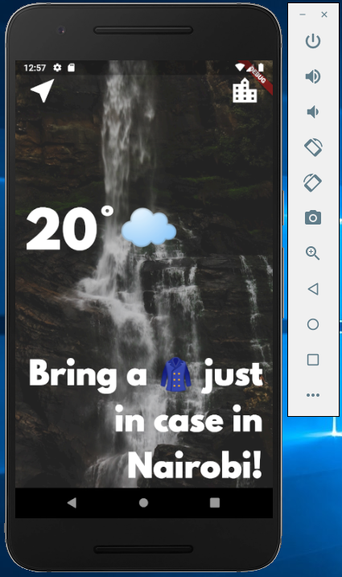
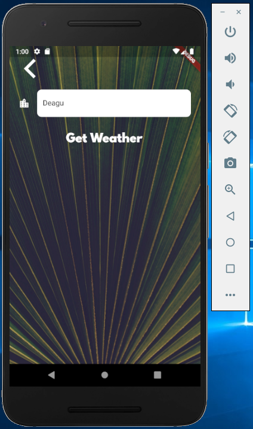
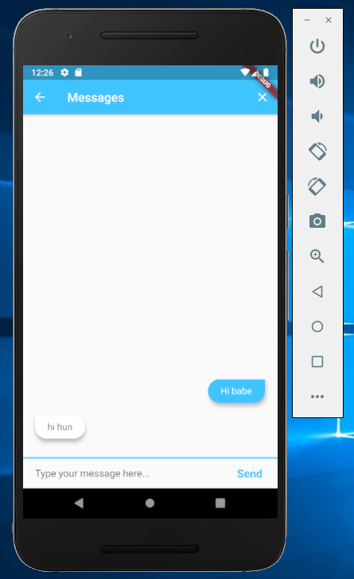
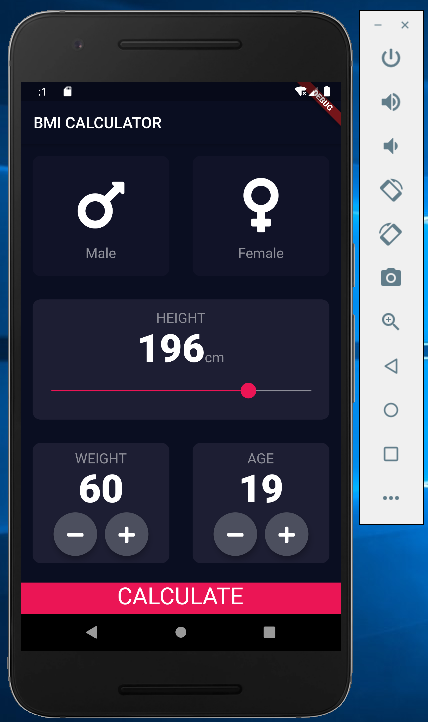

## Weather app:
The app shows weather information of major cities of the world.

The app can also show weather of information through users current GPS location.

This app demonstrates my ability to use the following:
- Flutter
- API : Fetching weather data using OpenWeatherMap.org API
- Pass data across multiple sceens/routes

 

## Message/Chat Application
The app provides means for sharing information among individuals and groups.

This app demonstrates my ability to use the following:
- Flutter
- Firestore Database
- User Authentication and Verification (Sign Up/Log In)
- Smooth UI/UX for reading and writing messages
- Pass data across multiple sceens/routes

## BMI Calculator
The app calculates users BMI (Body Mass Index) from input values of Height and Weight.

This app demonstrates my ability to use/do the following:
- Flutter
- Pixel perfect implementation of UI (came across the UI from Dribble)
- Pass data across multiple screens/routes
- Use of gestures in Android Mobile devices

## XYLOPHONE APP
The app is a virtual xylophone. Whenever a user taps a coloured bar, it produces a musical note.

This app demonstrate my ability to use/do the following:
- Play sound on Android device
- Capturing user input